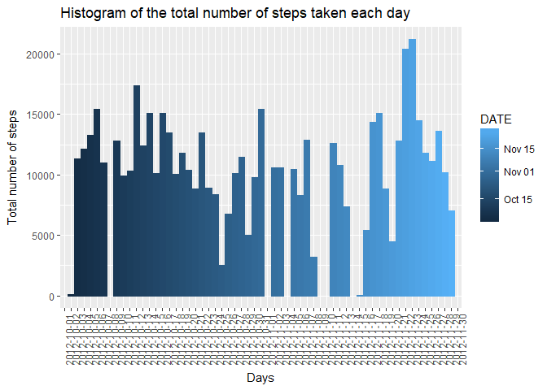
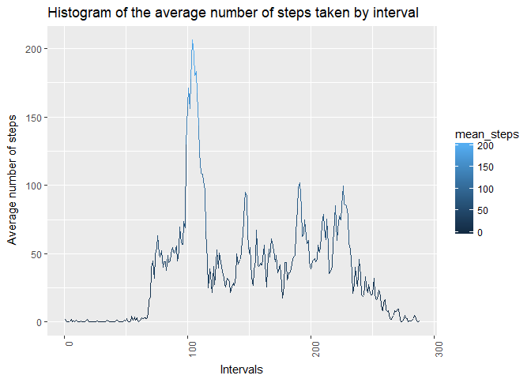
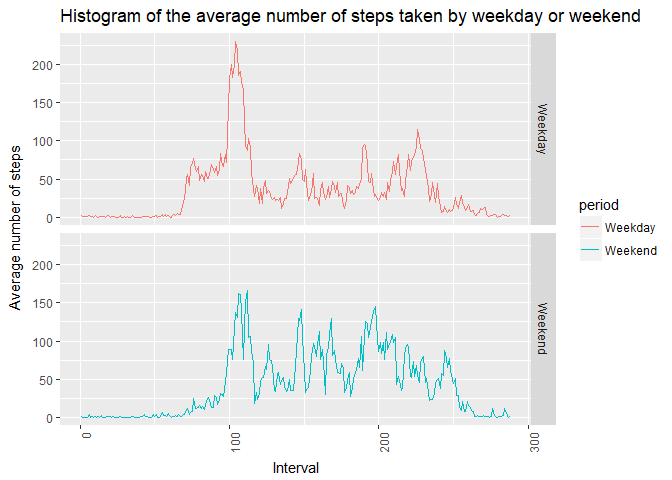

#Introduction

It is now possible to collect a large amount of data about personal movement using activity monitoring devices such as a Fitbit, Nike Fuelband, or Jawbone Up. These type of devices are part of the "quantified self" movement - a group of enthusiasts who take measurements about themselves regularly to improve their health, to find patterns in their behavior, or because they are tech geeks. But these data remain under-utilized both because the raw data are hard to obtain and there is a lack of statistical methods and software for processing and interpreting the data.

This assignment makes use of data from a personal activity monitoring device. This device collects data at 5 minute intervals through out the day. The data consists of two months of data from an anonymous individual collected during the months of October and November, 2012 and include the number of steps taken in 5 minute intervals each day.

The data for this assignment can be downloaded from the course web site:

* Dataset: [Activity monitoring data](https://d396qusza40orc.cloudfront.net/repdata%2Fdata%2Factivity.zip) 

The variables included in this dataset are:

* steps: Number of steps taking in a 5-minute interval (missing values are coded as NA)
* date: The date on which the measurement was taken in YYYY-MM-DD format
* interval: Identifier for the 5-minute interval in which measurement was taken

The dataset is stored in a comma-separated-value (CSV) file and there are a total of 17,568 observations in this dataset.

#Project

## Initialisation

First, as I live in France, I have to set my environment to "English".

```r
Sys.setlocale("LC_TIME", "English")
```

Configure the working directory with the function setwd.

Load the following libraries to be able to execute the code.

```r
library(dplyr)
library(ggplot2)
```

## Show any code that is needed to
1. Load the data (i.e. read.csv())


```r
# If the dataset is not present in the current working directory then download it
data.directorate<-"Course5_Week2_Project"
url <- "https://d396qusza40orc.cloudfront.net/repdata%2Fdata%2Factivity.zip"
zip.filename<-"repdata_Fdata_Factivity.zip"

# If not already downloaded, download and unzip the file
if (!file.exists(data.directorate)) {
        dir.create(data.directorate)
        download.file(url, paste(data.directorate, zip.filename, sep="/"))
        unzip(paste(data.directorate, zip.filename, sep="/"), exdir=data.directorate)
}

#Configure filename
filename <- "activity.csv"

# Delete extra var.
rm(url,zip.filename)

# Load Data
filepath <- paste(data.directorate,"/",filename,sep="")
data <- read.csv(file=filepath, header=TRUE, sep=",", na.strings="NA", stringsAsFactors=FALSE)
colnames(data)<-toupper(colnames(data)) #header en majuscules
rm(filepath)
```

2. Process/transform the data (if necessary) into a format suitable for your analysis

```r
data$DATE <- as.Date(as.character(data$DATE),"%Y-%m-%d")
data$INTERVAL <- as.factor(data$INTERVAL)

tbl_data<-tbl_df(data)
rm(data)
```

Let's have a quick look at our tidy dataset tbl_data.

```r
str(tbl_data)
```

```
## Classes 'tbl_df', 'tbl' and 'data.frame':	17568 obs. of  3 variables:
##  $ STEPS   : int  NA NA NA NA NA NA NA NA NA NA ...
##  $ DATE    : Date, format: "2012-10-01" "2012-10-01" ...
##  $ INTERVAL: Factor w/ 288 levels "0","5","10","15",..: 1 2 3 4 5 6 7 8 9 10 ...
```

## What is mean total number of steps taken per day?

1. Calculate the total number of steps taken per day

What I need to do is to first aggregate data. The aggregatation will avoid calculation each time I call the plot. 
It will also allowed further analyses as/if needed.

```r
AggStepsPerDay <- tbl_data %>%
        select(DATE,STEPS) %>%
        group_by(DATE) %>%
        summarise(total_steps = sum(STEPS)) %>%
        arrange(DATE)
```

Let's have a quick look at the results.

```r
head(AggStepsPerDay)
```

```
## # A tibble: 6 x 2
##   DATE       total_steps
##   <date>           <int>
## 1 2012-10-01          NA
## 2 2012-10-02         126
## 3 2012-10-03       11352
## 4 2012-10-04       12116
## 5 2012-10-05       13294
## 6 2012-10-06       15420
```

2. If you do not understand the difference between a histogram and a barplot, research the difference between them. Make a histogram of the total number of steps taken each day.


```r
q2 <- ggplot(AggStepsPerDay, aes(x=factor(DATE), y=total_steps)) +
        geom_histogram(stat="identity",aes(colour=DATE,fill=DATE)) +
        theme(axis.text.x = element_text(angle = 90, hjust = 1)) +
        xlab("Days") +
        ylab(expression('Total number of steps')) +
        ggtitle("Histogram of the total number of steps taken each day")
print(q2)
```

<!-- -->

3. Calculate and report the mean and median of the total number of steps taken per day

I will now calculate the mean and the median of our dataset aggregated.

```r
TotalMean <- mean(AggStepsPerDay$total_steps, na.rm=TRUE)
TotalMedian <- median(AggStepsPerDay$total_steps, na.rm=TRUE)
```

The mean is equal to 10766.19 and the median is equal to 10765.00.

## What is the average daily activity pattern?

1. Make a time series plot (i.e. type = "l") of the 5-minute interval (x-axis) and the average number of steps taken, averaged across all days (y-axis).

As I have done before, I will aggregate data.


```r
# Aggregate Steps Per Interval
AggStepsPerInterval <- tbl_data %>%
        select(INTERVAL,STEPS) %>%
        group_by(INTERVAL) %>%
        summarise(mean_steps = mean(STEPS,na.rm=TRUE)) %>%
        arrange(INTERVAL)
```

Plot time ! 

*I put as.integer for x axis to change the scale. If I let it INTERVAL as factor, I will see all the values and the plot is more readable.*


```r
q4 <- ggplot(AggStepsPerInterval, aes(x=as.integer(INTERVAL), y=mean_steps, group = 1)) +
        geom_line(aes(colour=mean_steps)) +
        theme(axis.text.x = element_text(angle = 90, hjust = 1)) +
        xlab("Intervals") +
        ylab(expression('Average number of steps')) +
        ggtitle("Histogram of the average number of steps taken by interval")
print(q4)
```

<!-- -->

2. Which 5-minute interval, on average across all the days in the dataset, contains the maximum number of steps?

I will use the which.max fonction to look for the maximum value.


```r
MaxNumberOfSteps <- AggStepsPerInterval[which.max(AggStepsPerInterval$mean_steps),]
```

The maximum 5-minute interval is the 835th with the value 206.17.

## Imputing missing value

*Note that there are a number of days/intervals where there are missing values (coded as NA). The presence of missing days may introduce bias into some calculations or summaries of the data.*

1. Calculate and report the total number of missing values in the dataset (i.e. the total number of rows with NAs)

Check first if there are NAs in our dataset.


```r
CheckNA <- tbl_data$STEPS
summary(CheckNA)
```

```
##    Min. 1st Qu.  Median    Mean 3rd Qu.    Max.    NA's 
##    0.00    0.00    0.00   37.38   12.00  806.00    2304
```

The summary gives us the information that there are NAs. Let's store the value in a variable.

```r
CountNA <- sum(is.na(tbl_data$STEPS))
```

The number of NAs is equal to 2304 and the percentage of NAs in our dataset is 13.11%.

2. Devise a strategy for filling in all of the missing values in the dataset. The strategy does not need to be 
sophisticated. For example, you could use the mean/median for that day, or the mean for that 5-minute interval, etc.

*Note : I've rolled a dice, "replacing missing data by the mean"" won :)*

I have two data.frame which contains both the INTERVAL variable. tbl_data contains STEPS, DATE and INTERVAL and  AggStepsPerInterval contains the mean of steps by interval. I have seen that the mean and the median are very close. Choosing one or the other will not change much for replacing missing values. In order to process less data as possible (remember the data scientist is sometimes lazy), I will use the mean which is already calculated. So I will first merge the two data.frame and then I will do a quick test : if my value STEPS equals NA then, I replace the value by the mean in a new column. If not, I will let the new  column as defined which means equals to STEPS.

3. Create a new dataset that is equal to the original dataset but with the missing data filled in.

The new dataset as define in point 2 is built as follows :


```r
tbl_data_NO_NA <- right_join(tbl_data,AggStepsPerInterval,by="INTERVAL")
tbl_data_NO_NA <- mutate(tbl_data_NO_NA,STEPS_NO_NA=STEPS)
len <- nrow(tbl_data_NO_NA)

for (i in 1:len) {
        if(is.na(tbl_data_NO_NA$STEPS_NO_NA[i])){
                tbl_data_NO_NA$STEPS_NO_NA[i] <- tbl_data_NO_NA$mean_steps[i]
        } 
next
}
```

Let's have a look at the new dateset (the column STEPS_NO_NA correspond to the result of our strategy)

```r
head(tbl_data_NO_NA)
```

```
## # A tibble: 6 x 5
##   STEPS DATE       INTERVAL mean_steps STEPS_NO_NA
##   <int> <date>     <fct>         <dbl>       <dbl>
## 1    NA 2012-10-01 0              1.72        1.72
## 2     0 2012-10-02 0              1.72        0.  
## 3     0 2012-10-03 0              1.72        0.  
## 4    47 2012-10-04 0              1.72       47.0 
## 5     0 2012-10-05 0              1.72        0.  
## 6     0 2012-10-06 0              1.72        0.
```

4.

+ Make a histogram of the total number of steps taken each day.


```r
q7 <- ggplot(tbl_data_NO_NA, aes(x=factor(DATE), y=STEPS_NO_NA)) +
        geom_histogram(stat="identity",aes(colour=DATE,fill=DATE)) +
        theme(axis.text.x = element_text(angle = 90, hjust = 1)) +
        xlab("Days") +
        ylab(expression('Total number of steps')) +
        ggtitle("Histogram of the total number of steps taken each day (NA values replaced by mean)")
print(q7)
```

<!-- -->

+ Calculate and report the mean and median total number of steps taken per day. 


```r
# Aggregate Steps Per Day after missing values are imputed
AggStepsPerDay_NO_NA <- tbl_data_NO_NA %>%
        select(DATE,STEPS_NO_NA) %>%
        group_by(DATE) %>%
        summarise(total_steps_NO_NA = sum(STEPS_NO_NA)) %>%
        arrange(DATE)

TotalMean_NO_NA <- mean(AggStepsPerDay_NO_NA$total_steps_NO_NA)
TotalMedian_NO_NA <- median(AggStepsPerDay_NO_NA$total_steps_NO_NA)
```

The mean is equal to 10766.19 and the median is equal to 10766.19.

+ Do these values differ from the estimates from the first part of the assignment? What is the impact of imputing missing data on the estimates of the total daily number of steps?

As expected there is a slight difference between before and after imputing missing data. The mean is the same as I have calculed the first one remonving NA (parameter na.rm=TRUE) and the median is really close to the mean.

What    | Before imputing NAs                           | After imputing NAs
--------|-----------------------------------------------|---------------------------------------------------
Mean    |10766.19      | 10766.19
Median  |10765.00    | 10766.19

## Are there differences in activity patterns between weekdays and weekends?

*For this part the weekdays() function may be of some help here. Use the dataset with the filled-in missing values for this part.*

1. Create a new factor variable in the dataset with two levels - "weekday" and "weekend" indicating whether a given date is a weekday or weekend day.

I create a new dataset based on the one where NAs had been imputed and I used the function weekdays


```r
# Add column and calculate day name
tbl_data_days <- tbl_data_NO_NA %>%
        select(DATE,INTERVAL,STEPS_NO_NA) %>%
        mutate(period = weekdays(DATE)) %>%
        arrange(DATE)

# Replace day name by weekend or weekday
len <- nrow(tbl_data_days)

for (i in 1:len) {
        if(tbl_data_days$period[i] == "Saturday" || tbl_data_days$period[i] == "Sunday"){
                tbl_data_days$period[i]<-"Weekend"
        } else {
                tbl_data_days$period[i]<-"Weekday"        
        }
        next
}
```

Let's have a look at the result.


```r
head(tbl_data_days)
```

```
## # A tibble: 6 x 4
##   DATE       INTERVAL STEPS_NO_NA period 
##   <date>     <fct>          <dbl> <chr>  
## 1 2012-10-01 0             1.72   Weekday
## 2 2012-10-01 5             0.340  Weekday
## 3 2012-10-01 10            0.132  Weekday
## 4 2012-10-01 15            0.151  Weekday
## 5 2012-10-01 20            0.0755 Weekday
## 6 2012-10-01 25            2.09   Weekday
```

2. Make a panel plot containing a time series plot (i.e. type = "l") of the 5-minute interval (x-axis) and the average number of steps taken, averaged across all weekday days or weekend days (y-axis). See the README file in the GitHub repository to see an example of what this plot should look like using simulated data.

As I have done before, I will aggregate data.


```r
# Aggregate Steps Per Period
AggStepsPerPeriod<- tbl_data_days %>%
        select(period,INTERVAL,STEPS_NO_NA) %>%
        group_by(period,INTERVAL) %>%
        summarise(mean_steps = mean(STEPS_NO_NA,na.rm=TRUE)) %>%
        arrange(period,INTERVAL)
```

Plot time ! 

*Note : I put as.integer for x axis to change the scale. If I let it INTERVAL as factor, I will see all the values and the plot is note readable*

```r
q8 <- ggplot(AggStepsPerPeriod, aes(x=as.integer(INTERVAL), y=mean_steps, group = period)) +
        geom_line(aes(colour=period)) +
        facet_grid(period~.) +
        theme(axis.text.x = element_text(angle = 90, hjust = 1)) +
        xlab("Interval") +
        ylab(expression('Average number of steps')) +
        ggtitle("Histogram of the average number of steps taken by weekday or weekend")
print(q8)
```

<!-- -->
